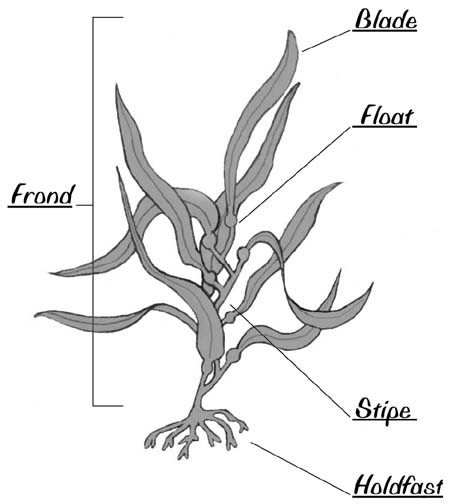

```{r echo_location, include=FALSE}
knitr::opts_chunk$set(echo = TRUE, message = FALSE)


```

 


## Set-up Documentation - Packages
```{r package_installs, include=TRUE}

library(tidyverse) #install.packages("tidyverse")
library(readxl) #install.packages("readxl")
library(here) #install.packages("here")
library(kableExtra) #install.packages("kableExtra")
#library(skimr) #install.packages("skimr")
#library(janitor) #install.packages("janitor")


```


## Data

Inverts Data will be read in here

```{r data_load}

fish <- read.csv(here("data","fish.csv"))

kelp_abur <- read_excel(here("data","kelp_fronds.xlsx"),
                        sheet = "abur")

fish
kelp_abur

```


## Filtering Features

Exact match: `==`


#### Example 1: Only keep obs form `fish` that has obs of `garibaldi`

```{r garibaldi_filter}


fish_garibaldi <- fish %>% 
  filter(common_name == "garibaldi")

fish_garibaldi


```


Other operators `>,<,>=,<=`

#### Example 2: Only keep obs with 50 or greater

```{r total_n_fifty}

filter_over_fifty <- fish %>% 
  filter(total_count >= 50)


filter_over_fifty 

```


Using `OR` statement filters

Can use the `|` for `OR` operators


#### Example 3: Use OR to find `garibaldi|blacksmith`

```{r fish2species}

fish2spec <- fish %>% 
  filter(common_name == 'garibaldi'|common_name =='blacksmith')

fish2spec


```

Using the `%in%` operator

Matches against a vector with multiple values

```{r in_matches}


fish_sp <- c('garibaldi','blacksmith','black surfperch')

fish_3sp <- fish %>% 
    filter(common_name %in% fish_sp)


fish_3sp
```


#### Example 4: Match year 2016, or the common_name is `garibaldi`

```{r year_fish_match}

fish_sp_yr <- fish %>% 
  filter(year == '2016' | common_name == 'garibaldi')

fish_sp_yr 


```


Using the `&` operator

May use `&` or `,`


```{r aque_2018}

fish_aq_18 <- fish %>% 
  filter(year == '2018' & site == 'aque')

fish_aq_18 


```


To exclude things -- `!=` operator

Same deal. No example. 


## Using `stringr::str_dectect()`

Finding stuff **like** a value with `str_dectect()`


```{r black_fish}

blk_fish <- fish %>% 
  filter(stringr::str_detect(
    common_name, pattern = "black"
  ))

blk_fish

```


#### Example 5: Subset by string `it`

```{r it_subs}


it_fish <- fish %>% 
  filter(stringr::str_detect(
    common_name, pattern = "it"
  ))

it_fish


```


## Joins to merge df 

Creates opportunities to make deliberate choices about a new table

Option 1: 
 - `full_join` - gives a complete merge; these are the same as SQL
  - `full_join(x,y, by = c("Species","Year"))`


#### Example 1: use the abur df to merge to fish df with full merge on `year` and `site`

```{r full_join_abur}

abur_kelfish <- kelp_abur %>% 
  full_join(fish, by = c("year","site"))

abur_kelfish


```


Option 2: 
 - `left_join` - gives a match from 2nd df only if on the 1st df
   - `left_join(x,y, by = c("Species","Year"))`
 
 
#### Example 2: use the abur df to merge to fish df with left merge on `year` and `site`

```{r left_join_abur}

left_kelfish <- kelp_abur %>% 
  left_join(fish, by = c("year","site"))

left_kelfish


```


Option 3: 
 - `right_join` - gives a match from 1st df only if on the 2nd df
   - `right_join(x,y, by = c("Species","Year"))`
 
 
No example;


Option 4: 
 - `inner_join` - gives a match with complete match on both
   - `inner_join(x,y, by = c("Species","Year"))`
 
 
#### Example 3: use the abur df to merge to fish df with inner merge on `year` and `site`
```{r inner_join_abur}

inner_kelfish <- kelp_abur %>% 
  inner_join(fish, by = c("year","site"))

inner_kelfish


```


