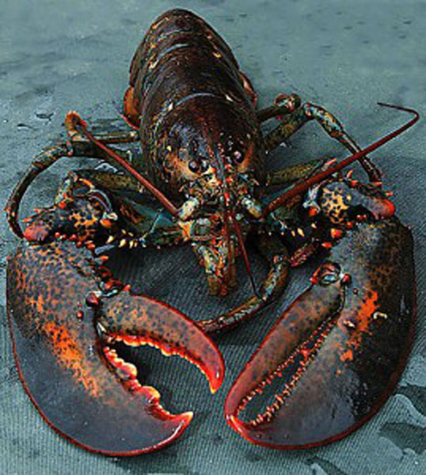

 


## Set-up Documentation - Packages
```{r package_installs}

library(tidyverse) #install.packages("tidyverse")
library(readxl) #install.packages("readxl")
library(skimr) #install.packages("skimr")
library(here) #install.packages("here")
library(kableExtra) #install.packages("kableExtra")

```

## Data

Lobster Data will be read in here

```{r data_load}

lobsters <- read_xlsx(here("data","lobsters.xlsx"), 
                      skip = 4)

head(lobsters)

```

## Viewing data with SkimR

```{r skimR_output}

skimr::skim(lobsters)
#gives us a pretty baller summary of the data that would take a longass fricken time in SQL to write...

```


## Making some pinchy Pivot Tables

Make R pivot tables like this: `group_by() %>% summarize()`

```{r pivotRtables}

lobsters %>% 
  group_by(site,year) %>% 
  summarise(count_by_site_year = n())
  
  
# use ctrl+shift+m for pipe
# n() counts observations 


```

## Two in the pot: Summarizing by multiple variables

```{r multivariate_pivot}

lobsta_site_year_sum <-lobsters %>% 
  group_by(site,year) %>% 
  summarise(count_by_site_year = n(),
            mean_size_mm = round(mean(size_mm, na.rm = TRUE),2),
            stdev_size_mm = round(sd(size_mm, na.rm = TRUE), 2)
            )
# used round() to limit to 0.01 place for aesthetics; defaults to 0.0001 

```

## Table Formatting with kableExtra::kable()

```{r tabley_table_formatted}

lobsta_site_year_sum %>%
  kable()


```

There are `r nrow(lobsters)` total lobsters included in this report. 


## Analysis
Here we will:
 - Build a median lobster size for each site and year 
 - Create a ggplot and save it


### Lobster Size Median by site
```{r median_lobster_size}

#lobsta_site_year_sum


lobsta_med <-
  lobsta_site_year_sum %>% 
  group_by(site,year) %>% 
  summarise(mean_site_size_mm = round(mean(mean_size_mm, na.rm = TRUE),2),
                     )

lobsta_med %>%
  kable()


```

### ggplot of median lobster size
```{r med_lobsta_plot}

lobsta_plot <-  ggplot(data = lobsta_med, aes(x=year, y = mean_site_size_mm)) 


lobsta_plot + geom_line(aes(color = site)) + theme_linedraw()
    
ggsave(here("figures","lobsta_plot.png"))

```


